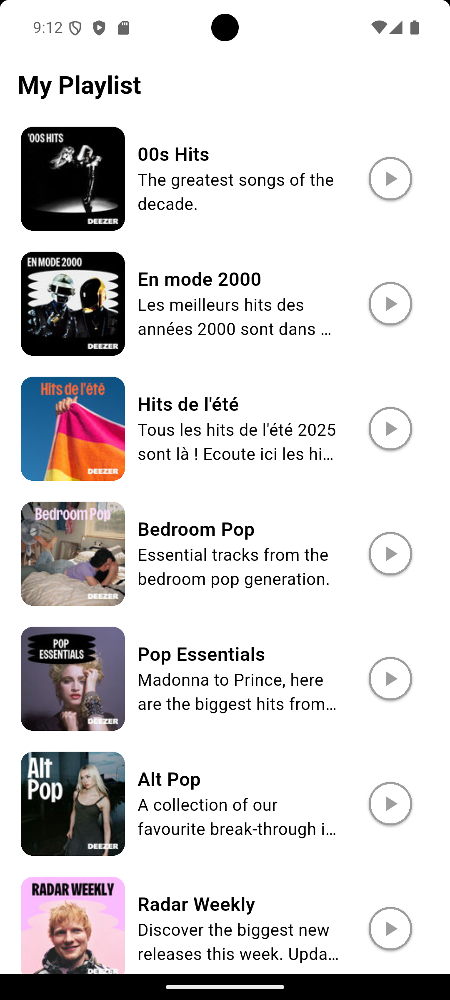
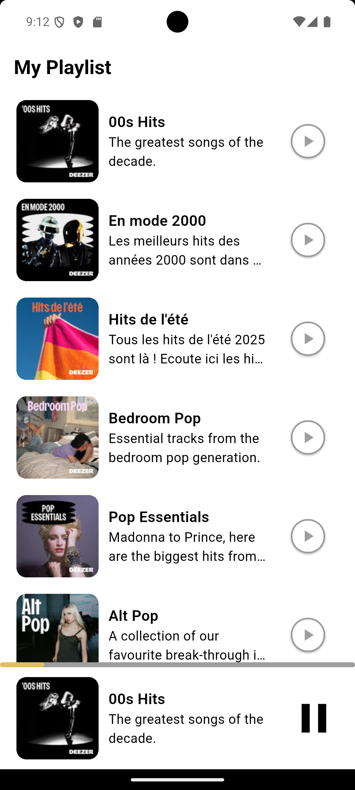
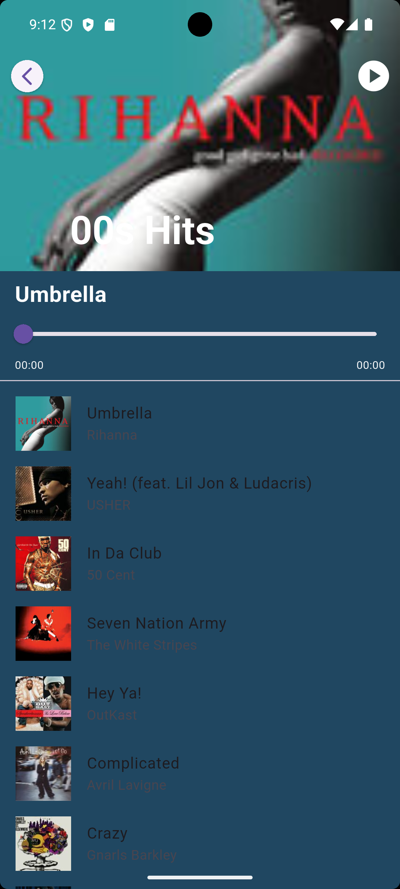
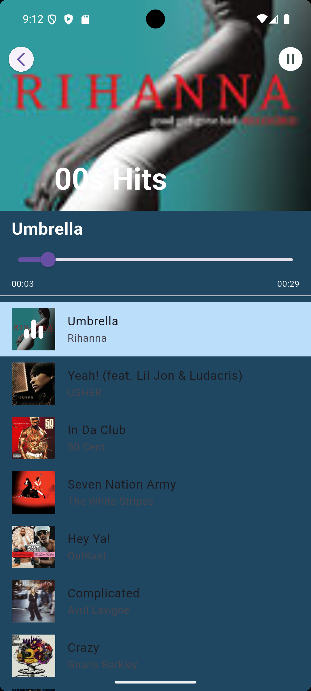

# music_app


A Flutter music application for streaming and managing playlists.  
This app allows users to browse playlists, play music, and manage their favorite tracks with a sleek and reactive UI.

---

## Overview

`music_app` is a starting point for building a Flutter music streaming app.  
It features playlist browsing, audio playback with progress tracking, and a reactive UI powered by GetX.

### Features

- Browse playlists and songs
- Play music with audio controls and progress bar
- View song details: title, artist, duration, album cover
- Support for local and online music streaming
- Reactive UI with GetX state management
- Lightweight and modular code structure

---

## Screenshots

<!-- Replace with your app screenshots -->






---

## Getting Started

Follow these steps to run the project locally.

### Prerequisites

- [Flutter SDK](https://docs.flutter.dev/get-started/install) installed
- An IDE such as [VS Code](https://code.visualstudio.com/) or [Android Studio](https://developer.android.com/studio)
- A device or emulator to run the app

### Installation

1. Clone the repository:

   ```bash
   git clone https://github.com/your-username/music_app.git

   ```

2. Navigate into the project directory:

   ```bash
   cd music_app

   ```

3. Install dependencies:

   ```bash
   flutter pub get

   ```

4. Run the app:
   ```bash
   flutter run
   ```

### Project Structure

music_app/
├── lib/
│ ├── controllers/ # GetX controllers for state management
│ ├── models/ # Data models (Music, Playlist, etc.)
│ ├── services/ # API and network services
│ ├── utils/ # Helper functions and utilities
│ ├── components/ # Reusable UI widgets (buttons, cards, music player, etc.)
│ ├── views/ # UI pages and screens
│ └── main.dart # App entry point
├── assets/ # Images, icons, and music files
├── pubspec.yaml # Project dependencies and metadata
└── README.md # This file
